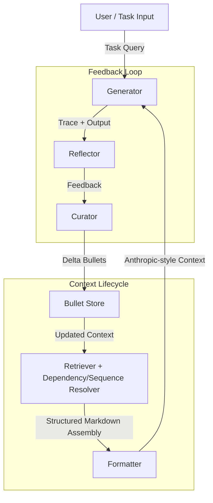

# 🧭 ContextKit — Product Requirements Document (v1.1)

**Status:** 🟡 In Progress  
**Priority:** 🚨 Critical  
**Owner:** Yigal Akselman  
**Last Updated:** 2025-10-13  

---

## 1. Overview

### **Purpose**
**ContextKit** is a modular toolkit for building, evolving, and reusing structured LLM context.  
It enables large language model (LLM) agents to maintain **structured, evolving, high-quality context**—aligning with Anthropic’s principles of clear sections, consistent formatting, and explicit metadata—while implementing the **Agentic Context Engineering (ACE)** loop of generation, reflection, and curation.

### **Goal**
To create a self-improving context system that:
- Curates, stores, and retrieves **context bullets** (atomic knowledge items).  
- Dynamically assembles Anthropic-style **Markdown context blocks** at runtime.  
- Continuously refines itself using **feedback loops** (Generator → Reflector → Curator).  
- Scales across agents, domains, and toolchains with minimal human intervention.

---

## 2. Problem Statement

Traditional prompt engineering is **static** and **manual**, causing:
- Context **collapse** (details lost through repeated rewriting).  
- **Brevity bias** (over-compressed instructions that omit domain heuristics).  
- Poor **traceability** and **reuse** of learned strategies.  
- Expensive re-prompting and inconsistent agent behavior.

**ContextKit** addresses these issues by introducing a **structured, adaptive memory layer**—a composable playbook that evolves with every agent interaction.

---

## 3. Objectives & Success Metrics

| Objective | Metric | Target |
|------------|---------|--------|
| Maintain structured, interpretable context | % of context conforming to schema | ≥ 95 % |
| Improve task accuracy | Δ over baseline LLM prompts | +8–12 % |
| Reduce context-update latency | Reflection + curation cycle time | −80 % vs. baseline |
| Preserve knowledge | Retention of prior “helpful” bullets after 10 iterations | ≥ 95 % |
| Enable explainability | Availability of traceable bullet history | 100 % auditable |

---

## 4. System Architecture

### **Core Components**

| Component | Description | Analog in ACE |
|------------|--------------|----------------|
| **Bullet Store** | JSONL / SQLite database of atomic context entries (`id`, `section`, `content`, metadata). | Adaptive Memory |
| **Manifest** | Global config controlling retrieval caps, ordering, dependency & sequence policies. | Context Policy |
| **Retriever** | Embedding + metadata filter that selects top-K bullets per section, resolves dependencies, and assembles sequences. | Context Selector |
| **Formatter** | Markdown assembler producing Anthropic-style structured context. | Context Generator |
| **Reflector** | Analyzes execution traces and labels bullets as helpful/harmful/neutral. | Feedback Agent |
| **Curator** | Updates or adds bullets based on reflections (incremental deltas). | Context Curation |
| **Evaluator** | Benchmarks context quality vs. baseline tasks. | Offline Evaluation |

### **Architecture Flow**



---

## 5. Data Model

### **Bullet Schema (v1.0)**
```json
{
  "$schema": "https://json-schema.org/draft/2020-12/schema",
  "$id": "https://contextkit.dev/schema/manifest-mvp.json",
  "title": "ContextKit Manifest (MVP)",
  "type": "object",
  "additionalProperties": false,
  "required": ["sections", "max_bullets_per_section", "ranking_weights", "markdown_format"],
  "properties": {
    "sections": {
      "type": "array",
      "items": {"type": "string"},
      "minItems": 1,
      "description": "Ordered list of Anthropic-style sections to render (e.g., role, tools, strategies, checklists, examples, sequences)."
    },
    "max_bullets_per_section": {
      "type": "integer",
      "minimum": 1,
      "description": "Hard cap for bullets included per section to manage token budget."
    },
    "ranking_weights": {
      "type": "object",
      "required": ["helpful", "recency", "semantic_match"],
      "properties": {
        "helpful": {"type": "number", "description": "Weight for helpful−harmful score."},
        "recency": {"type": "number", "description": "Weight for time decay / last_used."},
        "semantic_match": {"type": "number", "description": "Weight for embedding similarity to the current task."}
      },
      "additionalProperties": false,
      "description": "Weights for computing retrieval scores (normalized downstream)."
    },
    "markdown_format": {
      "type": "object",
      "required": ["header_prefix", "code_block_language_default"],
      "properties": {
        "header_prefix": {"type": "string", "description": "Prefix for Playbook section headers (e.g., '## Playbook — ')."},
        "code_block_language_default": {"type": "string", "description": "Default language tag for code fences when unspecified."}
      },
      "additionalProperties": false,
      "description": "Rendering options for deterministic Markdown output."
    },

    "dependency_policy": {
      "type": "object",
      "properties": {
        "max_hops": {"type": "integer", "minimum": 0, "default": 1}
      },
      "additionalProperties": false,
      "description": "Lightweight dependency closure control (optional for MVP)."
    },
    "sequence_policy": {
      "type": "object",
      "properties": {
        "max_steps_per_sequence": {"type": "integer", "minimum": 1, "default": 12}
      },
      "additionalProperties": false,
      "description": "Basic limit on steps included for any given sequence (optional for MVP)."
    }
  }
}
```

Example:
```json
{
  "id": "ctx-0102",
  "section": "examples",
  "content": "Fetch and paginate all invoices using the accounting API.",
  "code": {
    "language": "python",
    "snippet": "page = 1\nwhile True:\n    data = get_invoices(page=page)\n    if not data: break\n    process(data)\n    page += 1"
  },
  "tags": ["finance", "pagination"],
  "source": "reflection",
  "first_seen": "2025-10-12",
  "last_used": "2025-10-13",
  "depends_on": ["ctx-0098"],
  "conflicts_with": [],
  "supersedes": [],
  "sequence_id": "reconcile_shopify_qb_v1",
  "step_index": 30,
  "guards": ["env.has('QB_TOKEN')"],
  "optional": false,
  "counters": {"helpful": 2, "harmful": 0, "neutral": 0}
}
```

### **Manifest Schema**

```json
{
  "$schema": "https://json-schema.org/draft/2020-12/schema",
  "$id": "https://contextkit.dev/schema/manifest-mvp.json",
  "title": "ContextKit Manifest (MVP)",
  "type": "object",
  "additionalProperties": false,
  "required": ["sections", "max_bullets_per_section", "ranking_weights", "markdown_format"],
  "properties": {
    "sections": {
      "type": "array",
      "items": {"type": "string"},
      "minItems": 1,
      "description": "Ordered list of Anthropic-style sections to render (e.g., role, tools, strategies, checklists, examples, sequences)."
    },
    "max_bullets_per_section": {
      "type": "integer",
      "minimum": 1,
      "description": "Hard cap for bullets included per section to manage token budget."
    },
    "ranking_weights": {
      "type": "object",
      "required": ["helpful", "recency", "semantic_match"],
      "properties": {
        "helpful": {"type": "number", "description": "Weight for helpful−harmful score."},
        "recency": {"type": "number", "description": "Weight for time decay / last_used."},
        "semantic_match": {"type": "number", "description": "Weight for embedding similarity to the current task."}
      },
      "additionalProperties": false,
      "description": "Weights for computing retrieval scores (normalized downstream)."
    },
    "markdown_format": {
      "type": "object",
      "required": ["header_prefix", "code_block_language_default"],
      "properties": {
        "header_prefix": {"type": "string", "description": "Prefix for Playbook section headers (e.g., '## Playbook — ')."},
        "code_block_language_default": {"type": "string", "description": "Default language tag for code fences when unspecified."}
      },
      "additionalProperties": false,
      "description": "Rendering options for deterministic Markdown output."
    },

    "dependency_policy": {
      "type": "object",
      "properties": {
        "max_hops": {"type": "integer", "minimum": 0, "default": 1}
      },
      "additionalProperties": false,
      "description": "Lightweight dependency closure control (optional for MVP)."
    },
    "sequence_policy": {
      "type": "object",
      "properties": {
        "max_steps_per_sequence": {"type": "integer", "minimum": 1, "default": 12}
      },
      "additionalProperties": false,
      "description": "Basic limit on steps included for any given sequence (optional for MVP)."
    }
  }
}
```

Example:
```json
{
  "sections": ["role", "tools", "strategies", "checklists", "examples", "sequences"],
  "max_bullets_per_section": 5,
  "ranking_weights": {"helpful": 0.6, "recency": 0.3, "semantic_match": 0.1},
  "dependency_policy": {
    "max_hops": 1,
    "max_fan_in": 3,
    "max_fan_out": 5
  },
  "sequence_policy": {
    "max_steps_per_sequence": 12,
    "include_optional": true,
    "max_dependency_hops": 1
  },
  "markdown_format": {
    "header_prefix": "## Playbook — ",
    "code_block_language_default": "python"
  }
}
```

---

## 6. Functional Requirements

### 6.1 Context Assembly
- Retrieve top-K bullets per section, respecting dependencies.
- Resolve `depends_on`, `conflicts_with`, and `supersedes` before rendering.
- Assemble Markdown prompt following Anthropic layout:
  ```
  ## Role
  ## Tools
  ## Playbook — Strategies
  ## Playbook — Checklists
  ## Playbook — Examples
  ## Playbook — Procedure (Sequences)
  ```

### 6.1.1 Sequence Assembly (New)
- Identify candidate sequence(s) by `sequence_id` relevance.  
- Fetch all related step bullets, filter via `guards` and `preconditions`.  
- Topologically sort by `step_index` and dependencies.  
- Enforce manifest limits (`max_steps_per_sequence`).  
- Render ordered list with optional code and pre/postconditions.

### 6.2 Reflection & Feedback
- Reflector analyzes traces, classifies bullets (`helpful / harmful / neutral`).
- Generates structured JSON feedback for Curator input.

### 6.3 Curation Loop
- Curator integrates feedback deltas incrementally.
- Deduplication uses semantic similarity and recency.
- Harmful items auto-quarantined when thresholds reached.

### 6.4 Storage & Versioning
- Persistent store in SQLite or JSONL; versioning via timestamps.

### 6.5 APIs / Integration
- `get_context(task_id)` → returns full Markdown context.  
- `update_reflection(trace)` → updates counters & adds deltas.  
- `export_manifest()` → exports configuration snapshot.

---

## 7. Non-Functional Requirements

| Category | Requirement |
|-----------|--------------|
| **Performance** | Assemble context ≤ 300 ms for 2 K bullets |
| **Scalability** | Handle ≥ 10 K bullets / agent |
| **Explainability** | Every bullet has traceable lineage and dependency graph |
| **Safety** | Cascade quarantine on harmful dependencies |
| **Maintainability** | All schemas versioned and validated via JSON Schema |

---

## 8. Example Workflow

1. **Generator** executes task using current context.
2. **Reflector** analyzes success/failure and tags bullets.
3. **Curator** merges deltas, adds improved steps or dependencies.
4. **Retriever** resolves dependencies and sequences.
5. **Formatter** builds the final Markdown context.
6. **Evaluator** measures performance and adaptation cost.

---

## 9. Deliverables

| Milestone | Deliverable | ETA |
|------------|-------------|-----|
| v1.0 | Core schemas & retrieval pipeline | ✅ |
| v1.1 | Dependency & Sequence support | ✅ |
| v1.2 | Reflection–Curation feedback loop | +4 weeks |
| v1.3 | Evaluation Dashboard | +8 weeks |

---

## 10. Future Extensions
- Graph-based visualization of bullet dependencies.  
- Agent-specific manifests for domain fine-tuning.  
- Federated playbooks shared across agents.  
- Human-in-the-loop editor with visualization of sequence steps and dependency trees.

---

## 11. Summary

**ContextKit** operationalizes both *Anthropic’s context-engineering principles* (clarity, structure, metadata) and *ACE’s adaptive architecture* (generation, reflection, curation).  
Dependencies and sequences enhance its precision and maintainability, turning prompt design into a **self-improving, modular knowledge system**.

